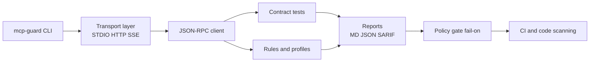
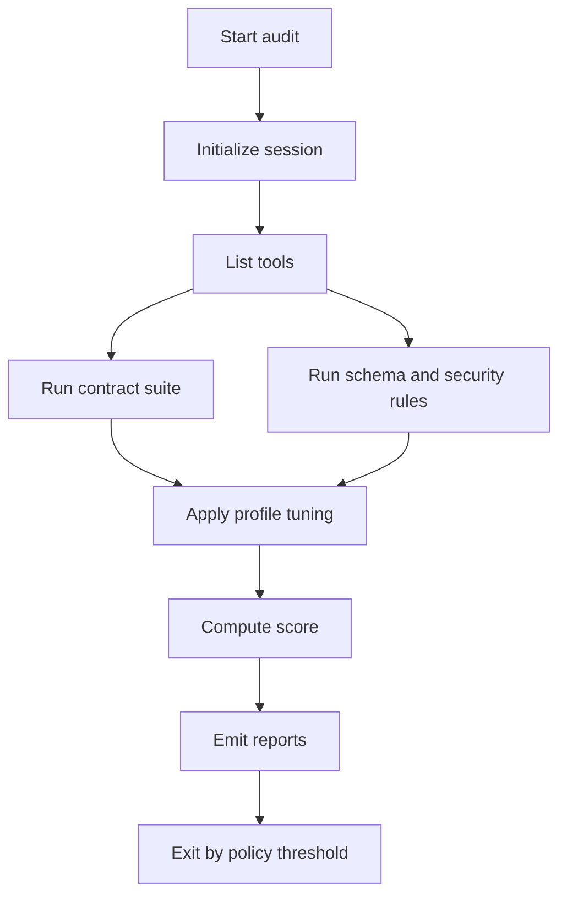

# mcp-guard

<div align="center">


**Security auditing and policy gating for MCP servers (local + CI).**  
Deterministic checks. Actionable findings. Reproducible reports.

[](./.github/workflows/ci.yml)
[](https://www.npmjs.com/package/@baichen_yu/mcp-guard)
[](./LICENSE)
[](./package.json)
[](https://tomas-1226.github.io/mcp-guard/)

</div>

---

> [!IMPORTANT]
> Remote mode supports **HTTP JSON-RPC** (`--http`) and **SSE** (`--sse`, optional `--sse-post`).

## Why people use mcp-guard

- ✅ **Deterministic contract tests** (no fuzzy behavior, no mystery calls)
- ✅ **Policy gate in CI** (`--fail-on off|low|medium|high`)
- ✅ **Security-focused rule packs** with profile controls (`default`, `strict`, `paranoid`)
- ✅ **Review-friendly output formats** (`report.md`, `report.json`, `report.sarif`)
- ✅ **Config discovery + redaction** for common MCP client config layouts

### Quick stats

| Signal | Value |
|---|---:|
| Transports | STDIO + HTTP JSON-RPC + SSE |
| Report formats | Markdown, JSON, SARIF |
| Rule profiles | 3 |
| Contract scenarios | list, call, error shape, cancellation behavior, large payload, timeout |
| Registry modes | lint, verify, score |

---

## 30-second quickstart

### 1) No install (`npx`)

```bash
npx @baichen_yu/mcp-guard audit \
  --stdio "node /absolute/path/to/your-mcp-server.cjs" \
  --out reports \
  --fail-on off
```

> [!TIP]
> `--stdio` runs in your **current working directory**. Use an absolute path or `cd` into the project that contains your server first.

### Local demo (from this repo root)

```bash
npm run fixtures:gen
npx @baichen_yu/mcp-guard audit \
  --stdio "node fixtures/servers/hello-mcp-server/server.cjs" \
  --out reports \
  --fail-on off
```

### 2) Global install

```bash
npm i -g @baichen_yu/mcp-guard
mcp-guard --help
```

### 3) Package + command naming

- npm package: **`@baichen_yu/mcp-guard`**
- runtime CLI command: **`mcp-guard`**
- first scoped publish command: **`npm publish --access public`**

---

## Architecture



### Audit pipeline



---

## Report preview

```text
# MCP Guard Report
- Risk score: 100/100
- Key findings: 0
- Contract tests: 6/6
- Target: node fixtures/servers/hello-mcp-server/server.cjs (stdio)
```

---

## Commands

```bash
# Validate / Test / Audit
mcp-guard validate --stdio "node server.cjs" --profile default --out reports
mcp-guard test --stdio "node server.cjs" --out reports
mcp-guard audit --stdio "node server.cjs" --profile strict --fail-on medium --sarif reports/report.sarif

# Remote audit (HTTP JSON-RPC)
mcp-guard audit --http "http://127.0.0.1:4010" --timeout-ms 30000 --fail-on off

# Remote audit (SSE stream + POST endpoint)
mcp-guard audit --sse "http://127.0.0.1:4013/sse" --sse-post "http://127.0.0.1:4013/message" --timeout-ms 30000 --fail-on off

# Config scan
mcp-guard scan --repo . --format md --out reports

# Registry checks
mcp-guard registry lint registry/servers.yaml
mcp-guard registry verify registry/servers.yaml --sample 5
mcp-guard registry score registry/servers.yaml
```

---

## CI integration (drop-in)

```yaml
jobs:
  mcp-audit:
    runs-on: ubuntu-latest
    permissions:
      security-events: write
      actions: read
      contents: read
    steps:
      - uses: actions/checkout@v4
      - uses: actions/setup-node@v4
        with:
          node-version: 20
      - uses: ./.github/actions/mcp-guard
        with:
          stdio_command: node fixtures/servers/hello-mcp-server/server.cjs
          fail_on: high
```

---

## Automated releases

- On each push to `main`, `.github/workflows/release.yml` now:
  - runs lint/test/build
  - bumps patch version automatically
  - creates a GitHub Release with generated release notes
  - publishes the new package to npm (requires `NPM_TOKEN`)
- For npm publishing in CI, set `NPM_TOKEN` to an **npm Automation token** (no interactive password/OTP required).

## Docs site (GitHub Pages)

- URL pattern: `https://<owner>.github.io/mcp-guard/`
- Current docs: https://tomas-1226.github.io/mcp-guard/
- One-time setup: **Settings → Pages → Source → GitHub Actions**

---

## Troubleshooting

<details>
<summary><strong>Publishing ENOENT / package.json not found</strong></summary>

Run `npm publish` from the project root (the directory containing `package.json`).

</details>

<details>
<summary><strong>HTTP target fails</strong></summary>

Confirm endpoint supports JSON-RPC via HTTP POST and increase `--timeout-ms` if startup is slow.

</details>

<details>
<summary><strong>Windows command quoting</strong></summary>

Wrap `--stdio` values in double quotes.

</details>

---

## Release helper

Build release artifacts locally:

```bash
./scripts/build-release-local.sh
```

---

## Links

- Docs: https://tomas-1226.github.io/mcp-guard/
- GitHub: https://github.com/TomAs-1226/mcp-guard
- npm: https://www.npmjs.com/package/@baichen_yu/mcp-guard

## License

MIT. See [LICENSE](LICENSE).
