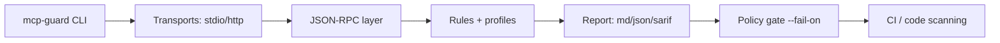

# mcp-guard

[](./.github/workflows/ci.yml)
[](https://www.npmjs.com/package/mcp-guard)
[](./LICENSE)

Security auditing and policy gating for MCP servers (local + CI), with Markdown and SARIF output.

> Formerly **mcp-doctor**.
>
> **Remote mode support in v0.3.0: HTTP JSON-RPC only (`--http`). SSE is not supported yet.**

## 30-second quickstart

### A) No install (npx)

```bash
npx mcp-guard audit --stdio "node fixtures/servers/hello-mcp-server/server.cjs" --out reports --fail-on off
```

### B) Global install

```bash
npm i -g mcp-guard
mcp-guard --help
```

### C) CI quickstart (GitHub Action)

```yaml
jobs:
  mcp-audit:
    runs-on: ubuntu-latest
    permissions:
      security-events: write
      actions: read
      contents: read
    steps:
      - uses: actions/checkout@v4
      - uses: actions/setup-node@v4
        with:
          node-version: 20
      - uses: ./.github/actions/mcp-guard
        with:
          stdio_command: node fixtures/servers/hello-mcp-server/server.cjs
          fail_on: high
```

More details: [`docs/github-action.md`](docs/github-action.md).

## What it does

- Connects to MCP servers over **STDIO** (`--stdio`) and **HTTP JSON-RPC** (`--http`).
- Runs deterministic contract tests (list tools, call tool, error shape, cancellation behavior, large payload, timeout behavior).
- Applies schema/security rules with profiles (`default`, `strict`, `paranoid`).
- Produces reproducible reports (`report.md`, `report.json`, `report.sarif`).
- Supports policy gating with `--fail-on off|low|medium|high`.
- Scans local config files (Claude Desktop/Cursor patterns) with token redaction.

## In 10 seconds: output preview

```text
# MCP Guard Report
- Risk score: 100/100
- Key findings: 0
- Contract tests: 6/6
- Target: node fixtures/servers/hello-mcp-server/server.cjs (stdio)
```

## Commands

```bash
# Validate / test / audit
mcp-guard validate --stdio "node server.cjs" --profile default --out reports
mcp-guard test --stdio "node server.cjs" --out reports
mcp-guard audit --stdio "node server.cjs" --profile strict --fail-on medium --sarif reports/report.sarif

# Remote audit (HTTP JSON-RPC only)
mcp-guard audit --http "http://127.0.0.1:4010" --timeout-ms 30000 --fail-on off

# Config scan
mcp-guard scan --repo . --format md --out reports
mcp-guard scan --path ~/.config/Claude/claude_desktop_config.json --format json --out reports

# Registry tools
mcp-guard registry lint registry/servers.yaml
mcp-guard registry verify registry/servers.yaml --sample 5
mcp-guard registry score registry/servers.yaml
```

Full CLI reference: [`docs/cli.md`](docs/cli.md).

## Architecture



## Why teams use it

- Deterministic contract tests.
- Reproducible, diff-friendly report outputs.
- Offline-style registry verification heuristics.
- Profile-based risk posture without custom scripting.

## What is not supported (yet)

- SSE transport.
- Arbitrary tool fuzzing (contract tests are intentionally bounded).

## Troubleshooting

- **Node version**: use Node `>=20`.
- **Windows quoting**: wrap `--stdio` command in double quotes.
- **Timeouts**: increase `--timeout-ms` for slower startup servers.
- **HTTP mode failures**: ensure target is JSON-RPC over HTTP POST.

## Docs

- [`docs/quickstart.md`](docs/quickstart.md)
- [`docs/cli.md`](docs/cli.md)
- [`docs/security-model.md`](docs/security-model.md)
- [`docs/rules.md`](docs/rules.md)
- [`docs/github-action.md`](docs/github-action.md)
- [`RELEASE.md`](RELEASE.md)

## Contributing

- Add a rule in `src/security/rules/*` and document it in `docs/rules.md`.
- Add contract coverage in `src/tests/contract/*` and `test/contract.spec.ts`.
- Add fixture data with `npm run fixtures:gen`.

## License

MIT. See [`LICENSE`](LICENSE).
